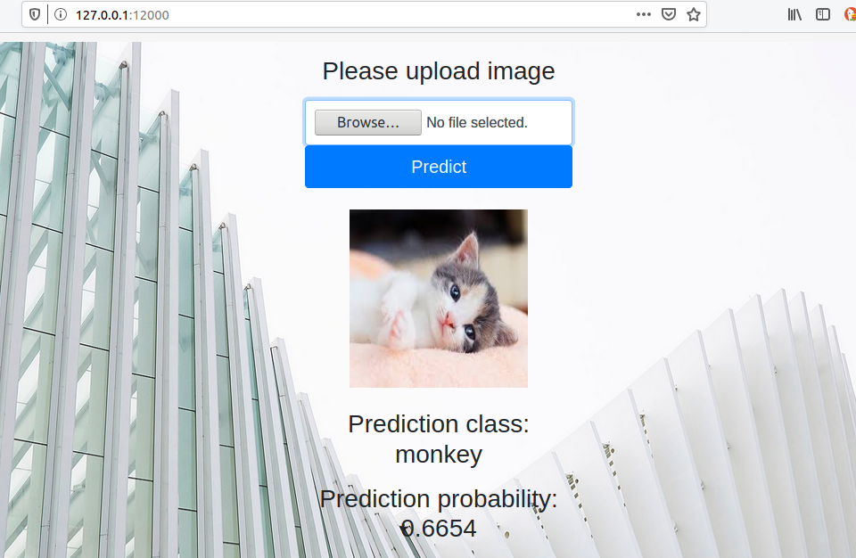

# :rocket: Simple Web framework to showcase computer vision work

- This project aims to create a simple general web framework that can be reused to showcase any computer vision work. The original code and idea is borrowed from [this](https://www.youtube.com/watch?v=BUh76-xD5qU) great video by [Abhishek Thakur](https://www.kaggle.com/abhishek) where he created this simple bootstrap based framework to host an image classification task using a deep learning model. I have slightly modified it. 

- Here I have simplified it, and used a dummy simple random prediction model as a baseline just to create the web framework. The idea is, this project can be reused for other actual computer vision project to showcase your work.  

- Feel free to use it.

----